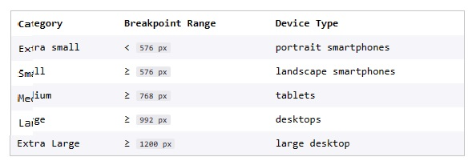

[This is the link to the lesson](https://www.codecademy.com/courses/learn-bootstrap/lessons/learn-bootstrap-grid/exercises/breakpoints)

# LEARN BOOTSTRAP 4: GRID

## Bootstrap Breakpoints

One benefit of using Bootstrap is that it incorporates responsive design. With responsive design, the layout of the content changes to accommodate a user’s screen size.

Bootstrap categorizes screen sizes into 5 categories or as breakpoints: extra small, small, medium, large, and extra large. Each breakpoint has a range measured in pixels. The range of these breakpoints and accompanying device types are marked in the following table:

By using these breakpoints in combination with Bootstrap’s grid, we can customize the layout of our content for different screens.

### Instructions

> Examine the provided GIF, notice how the content of the webpage changes on different screen sizes.

memory jog:
/c/Users/glads/Documents/PROJECTS_AT_CODECADEMY/LEARN-BOOTSTRAP-4_GRID-Bootstrap-Breakpoints
